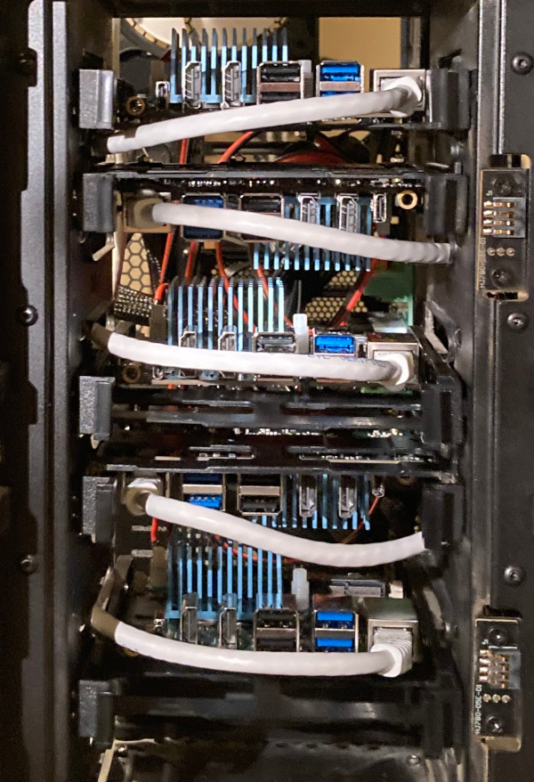

# Rock5 Cluster

This is a homelab experiment to build a cluster of Rock5 hypervisors that can be used to run Kubernetes on ARM in guest VM's distributed across the physical nodes.

See the [slides](img/rock5_arm_cluster.pdf) for the story. It's like a server rack, but tiny!



## Specs

<https://wiki.radxa.com/Rock5/hardware/5b>

Each node has:
- 8 cores: 4 Cortex-A76 + 4 Cortex-A55
- 16 GB RAM
- 32 GB PNY MicroSD card (boot device)
- 1 TB Samsung 980 NVMe SSD (VM data)

## Host Setup

1) Follow [Radxa instructions](https://wiki.radxa.com/Rock5/install/microSD) for flashing Debian 11 image to a microSD card to use as the boot device

2) scp `authorized_keys` to `/home/rock/.ssh/authorized_keys` on each node

3) Change user password away from the default

4) Run `host/bootstrap.sh` on the node as root from console

5) Run `make setup` for remaining node setup (after updating inventory files)

6) Run `make reboot` to reboot the nodes

## Create Test VM's

Edit `cloud-init/user-data` and add keys to `ssh_authorized_keys` section.

To make sure starting a basic VM on each node works:

```sh
make createvm
make destroyvm
```

## Create Kubernetes VM's

1) Create the VM's:

```sh
make createmasters
make createworkers
```

2) Assign static IP's from router

3) Update inventory files

4) Run [kubespray](https://github.com/kubernetes-sigs/kubespray)

```sh
cd ~/src/kubespray
cp -r inventory/sample inventory/mycluster
cp ~/src/rock5-cluster/kubespray.ini inventory/mycluster/inventory.ini
ansible-playbook -i inventory/mycluster/inventory.ini cluster.yml -b -v
```

## TODO

- refactor "create vm" into a generic task, too many copies of the same script
  - use a single template for the VM's too
- don't overwrite existing disk images if they exist
- test CPU pinning to assign the VM to A55 or A76 cores

